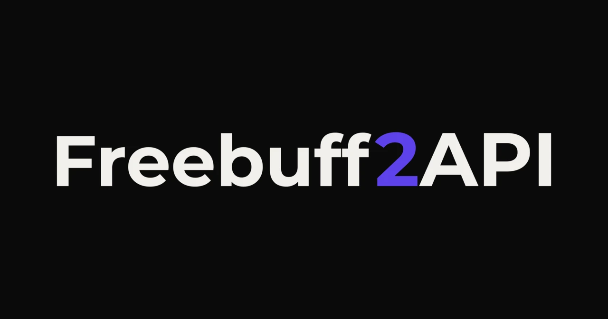

<div align="center">



# Freebuff2API

[](https://www.gnu.org/licenses/gpl-3.0)
[](https://www.npmjs.com/package/freebuff2api-proxy)
[](https://github.com/IMROVOID/Freebuff2API/actions/workflows/test.yml)
[](https://nodejs.org/)
[](https://www.typescriptlang.org/)
[](https://workers.cloudflare.com/)
[](https://platform.openai.com/docs/api-reference)

<p align="center">
  High-performance, dual-runtime OpenAI-compatible API router and OAuth proxy for <b><a href="https://freebuff.com">Freebuff</a></b>. Bridge Freebuff's free unmetered AI access into a universal OpenAI API gateway with <b>Multi-Account Pooling</b>, <b>Anti-Ban Wire Guard</b>, and <b>Seamless Stream Aggregation</b> across <b>Claude Code, Codex, Cursor, Antigravity, and SDKs</b>.
</p>

[Overview](#what-is-freebuff2api) • [Features](#key-features) • [Quick Start](#quick-start) • [Models](#model-catalog--aliases) • [Clients](#client-integration) • [Architecture](#architecture--structure) • [Guides](#advanced-guides) • [Disclaimer](#disclaimer--legal-notice) • [License](#license)

</div>

## Table of Contents

- [What is Freebuff2API?](#what-is-freebuff2api)
- [Key Features](#key-features)
- [Quick Start](#quick-start)
  - [Method 1: Local Daemon (NPX / NPM)](#method-1-local-daemon-npx--npm)
  - [Method 2: Cloudflare Workers (Serverless)](#method-2-cloudflare-workers-serverless)
- [Model Catalog & Aliases](#model-catalog--aliases)
  - [Freebuff Unmetered Community Allocation](#freebuff-unmetered-community-allocation)
- [Client Integration](#client-integration)
- [Architecture & Structure](#architecture--structure)
- [Advanced Guides](#advanced-guides)
  - [Anti-Ban Wire Guard & Preamble Injection](#anti-ban-wire-guard--preamble-injection)
  - [Multi-Account Pooling & Automatic Cooldown](#multi-account-pooling--automatic-cooldown)
  - [Zero-Config CLI Credential Auto-Discovery](#zero-config-cli-credential-auto-discovery)
  - [Forced Streaming & Stream Aggregator](#forced-streaming--stream-aggregator)
  - [Environment Variables](#environment-variables)
- [Development & Testing](#development--testing)
  - [Continuous Integration (CI)](#continuous-integration-ci)
- [Disclaimer & Legal Notice](#disclaimer--legal-notice)
- [License](#license)

## What is Freebuff2API?

[Freebuff](https://freebuff.com) (powered by Codebuff) offers unmetered, community-allocated access to leading frontier models including **DeepSeek V4.1 Flash**, **GLM 5.3 Flash**, **GPT-6 Luna**, **MiMo 2.6 Pro**, and **Gemini 3.8 Flash**. However, Freebuff is designed strictly around its official interactive CLI (`bunx freebuff`). Its backend employs strict bot detection and wire verification:

1. Rejects requests from non-official client harnesses with `403 Forbidden` (`free_mode_cli_required` or `foreign_system_prompt`).
2. Requires position 0 of the first system prompt to start with the canonical Buffy assistant identity.
3. Demands strict User-Agent segregation (`ai-sdk/openai-compatible/1.0.0/codebuff` for inference, `Bun/1.3.14` for authentication and session admission).
4. Strictly enforces Server-Sent Events (`stream: true`), rejecting standard non-streaming JSON calls.
5. Requires custom `codebuff_metadata` envelopes with unique client hashes and active session instance identifiers.

Modern coding agents like **Claude Code, Codex, Cursor, Antigravity, Cline, OpenCode, and Roo Code** require a standard OpenAI-compatible API (`/v1/chat/completions`) with standard JSON and streaming support.

**Freebuff2API** bridges this gap:

1. It acts as an intelligent router and proxy between standard coding agents and Freebuff's backend (`https://freebuff.com`).
2. It automatically injects required preambles, scrubs conflicting agent markers, formats metadata, and generates session admission instances.
3. It transforms upstream SSE streams in real-time for streaming clients, and seamlessly aggregates chunks in memory when clients request non-streaming completions (`stream: false`).
4. It manages multiple Freebuff accounts concurrently with round-robin load distribution and exponential backoff circuit breakers upon rate-limit (`429`) errors.
5. It features a dual-runtime architecture: run locally as a zero-dependency **Node.js Daemon** (`http://127.0.0.1:8787`) or deploy as an 86 KB standalone **Cloudflare Worker** (`worker.js`).

> **Disclaimer**: This tool is provided strictly for personal educational and interoperability testing purposes. See [Disclaimer & Legal Notice](#disclaimer--legal-notice).

## Key Features

- **Unlock Unmetered Frontier Models for Coding Agents**: Access `deepseek/deepseek-v4-flash`, `z-ai/glm-5.3-flash`, `openai/gpt-6-luna`, `xiaomi/mimo-v2.6-pro`, and `google/gemini-3.8-flash` directly from your favorite tools.
- **Dual Operational Modes**:
  - **Local Daemon**: Runs on `http://127.0.0.1:8787` via `@hono/node-server` with instant NPX execution, CLI flags, or background daemon setup.
  - **Cloudflare Worker**: Standalone 86 KB bundle (`worker.js`) deployable with zero external runtime dependencies via Cloudflare Dashboard or Wrangler.
- **Anti-Ban Wire Guard**: Transparently satisfies Freebuff's strict validation checks:
  - Canonical Buffy preamble injection at position 0 (`You are Buffy, the strategic coding assistant...`).
  - Automatic scrubbing of foreign agent signatures (`You are Claude Code`, `Anthropic's official CLI`, etc.).
  - Header conformance (`ai-sdk/openai-compatible/1.0.0/codebuff` vs `Bun/1.3.14`).
  - Injects `codebuff_metadata` (`run_id`, `client_id`, `trace_session_id`, `freebuff_instance_id`, `cost_mode: "free"`).
- **Multi-Account Pooling & Circuit Breaker**: Round-robin request distribution across unlimited Freebuff accounts. Quarantines rate-limited (`429`) accounts with exponential backoff (starting at 60s, doubling up to 15m) without dropping client traffic.
- **Seamless Streaming & In-Memory Aggregation**: Real-time SSE streaming for `stream: true`, and automatic chunk buffer aggregation into standard OpenAI completion responses when `stream: false`.
- **Zero-Config CLI Credential Auto-Discovery**: Automatically parses local Freebuff/Codebuff credentials from `~/.config/manicode/credentials.json` (and Windows `%APPDATA%`) with UTF-8 BOM safety.
- **Interactive Headless OAuth Login**: Built-in `freebuff2api login` command authenticates via Freebuff's browser device-code OAuth flow.

## Quick Start

### Method 1: Local Daemon (NPX / NPM)

#### Option A: Run Instantly with NPX (Zero Install)

Run the local proxy daemon immediately with no clone or install needed:

```bash
npx freebuff2api-proxy serve
```

Or with custom port and explicit token:

```bash
npx freebuff2api-proxy serve --port 8787 --token fb_live_your_token
```

#### Option B: Global CLI Installation

Install globally to make both `freebuff2api` and `freebuff2api-proxy` commands available anywhere on your system:

```bash
npm install -g freebuff2api-proxy
```

Then run:

```bash
# Start the local daemon (both freebuff2api and freebuff2api-proxy binaries available)
freebuff2api serve

# Authenticate via browser device-code flow
freebuff2api login

# View all discovered and configured accounts
freebuff2api accounts

# Show CLI options
freebuff2api --help
```

#### CLI Options & Flags

| Flag | Shorthand | Environment Variable | Default | Description |
|---|---|---|---|---|
| `--port` | `-p` | `PORT` | `8787` | Port for the local HTTP server |
| `--host` | `-h` | `HOST` | `127.0.0.1` | Host address to bind to |
| `--token` | `-t` | `FREEBUFF_AUTH_TOKEN` | *(None)* | Explicit Freebuff bearer token override |
| `--upstream` | `-u` | `FREEBUFF_UPSTREAM_BASE` | `https://freebuff.com` | Target Freebuff API base URL |
| `--help` | | | | Show CLI help and options |
| `--version` | `-V` | | | Show installed version |

#### Option C: Clone and Run from Source

```bash
git clone https://github.com/IMROVOID/Freebuff2API.git
cd Freebuff2API
npm install
npm run dev
```

Your local endpoint is available at `http://127.0.0.1:8787/v1`. Default API key for all clients is `sk-freebuff` (or your personal Freebuff token).

### Method 2: Cloudflare Workers (Serverless)

Deploy a 24/7 serverless gateway on Cloudflare's global edge network without keeping your local machine running.

#### Step 1: Build the Worker Bundle (Optional)

```bash
npm run build
```

This compiles the standalone zero-dependency bundle to [`worker.js`](./worker.js) in the project root.

#### Step 2: Create Worker in Cloudflare Dashboard (Primary Method)

1. Log into the [Cloudflare Dashboard](https://dash.cloudflare.com).
2. Go to **Workers & Pages** -> **Create application** -> **Create Worker**.
3. Set the name to `freebuff2api` and click **Deploy**.
4. Click **Edit code**, select all existing code, delete it, and paste the entire copied contents of [`worker.js`](./worker.js).
5. Click **Deploy** in the top right.

#### Step 3: Add Variables & Secrets (Optional)

In your Worker, navigate to **Settings** -> **Variables and Secrets** and add:

| Variable | Type | Required | Default | Description |
|---|---|---|---|---|
| `FREEBUFF_AUTH_TOKENS` | Secret | Optional | *(None)* | Comma-separated list of Freebuff tokens for multi-account pooling |
| `FREEBUFF_AUTH_TOKEN` | Secret | Optional | *(None)* | Single Freebuff bearer auth token |
| `UPSTREAM_BASE` | Text | Optional | `https://freebuff.com` | Target Freebuff API base endpoint |
| `DEFAULT_MODEL` | Text | Optional | `deepseek/deepseek-v4-flash` | Default model when unspecified |

Click **Save and deploy**.

Your Cloudflare Worker API URL:

```
https://freebuff2api.<your-subdomain>.workers.dev/v1
```

#### Alternative: Deploy via Wrangler CLI

If you prefer deploying via the command line:

```bash
# 1. Set secret token in Cloudflare (optional)
npx wrangler secret put FREEBUFF_AUTH_TOKENS

# 2. Deploy
npm run deploy:worker
```

## Model Catalog & Aliases

Freebuff2API automatically maps requested model aliases to canonical upstream models:

| Request Model Alias | Canonical Upstream Model | Provider | Context | Strengths | Type |
|---|---|---|---|---|---|
| `deepseek/deepseek-v4-flash`, `gpt-4o`, `gpt-4o-mini`, `deepseek-chat`, `deepseek-coder`, `claude-3-5-sonnet` | `deepseek/deepseek-v4-flash` | DeepSeek | 128K | **Default model**; agentic coding & tool use | Fast / Coding |
| `z-ai/glm-5.3-flash`, `claude-3-7-sonnet`, `glm-4` | `z-ai/glm-5.3-flash` | Z-AI | 128K | Deep reasoning, logic, and mathematics | Reasoning |
| `openai/gpt-6-luna` | `openai/gpt-6-luna` | OpenAI | 128K | General conversational intelligence & flex queue | Balanced |
| `xiaomi/mimo-v2.5` | `xiaomi/mimo-v2.5` | Xiaomi | 64K | High-throughput low-latency tasks | Fast |
| `xiaomi/mimo-v2.6-pro` | `xiaomi/mimo-v2.6-pro` | Xiaomi | 128K | Advanced system architecture & deep thinking | Pro |
| `google/gemini-3.8-flash`, `gemini-flash` | `google/gemini-3.8-flash` | Google | 1M | Ultra-long document synthesis & multimodal | 1M Context |
| `stealth/space-bunny-alpha` | `stealth/space-bunny-alpha` | Stealth | 1M | Full codebase repository ingestion | 1M Context |
| `upstage/solar-mini-4` | `upstage/solar-mini-4` | Upstage | 32K | Low-latency summaries & quick tasks | Ultra-fast |
| `meta/muse-spark-1.2-contributor` | `meta/muse-spark-1.2-contributor` | Meta | 64K | Community flex allocation model | Flex |

### Freebuff Unmetered Community Allocation

> [!NOTE]
> Freebuff offers unmetered community allocations for developers. Models like `deepseek/deepseek-v4-flash` and `z-ai/glm-5.3-flash` provide fast responses without consumption counters. Freebuff2API attaches the required `cost_mode: "free"` and `wallet_spend_limit: 0` headers, ensuring no unexpected billing.

## Client Integration

> **Note**: For all clients below, replace `http://127.0.0.1:8787/v1` with your Cloudflare Worker URL (`https://freebuff2api.<your-subdomain>.workers.dev/v1`) if using serverless deployment. The default API key is `sk-freebuff` (or your Freebuff token).

<details>
<summary><b>9Router</b></summary>

Configuration file path:

```text
~/.9router/db.json
```

Or configure via Web Dashboard under **Providers** -> **Add Custom Provider**:

- Provider Type: `openai`
- Base URL: `http://127.0.0.1:8787/v1`
- API Key: `sk-freebuff`
- Models: `deepseek/deepseek-v4-flash, z-ai/glm-5.3-flash, openai/gpt-6-luna, google/gemini-3.8-flash`

Configuration entry for `~/.9router/db.json`:

```json
{
  "providers": [
    {
      "id": "freebuff2api",
      "name": "Freebuff2API",
      "type": "openai",
      "baseUrl": "http://127.0.0.1:8787/v1",
      "apiKey": "sk-freebuff",
      "models": [
        "deepseek/deepseek-v4-flash",
        "z-ai/glm-5.3-flash",
        "openai/gpt-6-luna",
        "google/gemini-3.8-flash"
      ]
    }
  ]
}
```

</details>

<details>
<summary><b>Aider</b></summary>

Configuration file path:

```text
.aider.conf.yml
```

Add configuration:

```yaml
openai-api-base: http://127.0.0.1:8787/v1
openai-api-key: sk-freebuff
model: openai/deepseek/deepseek-v4-flash
```

Or run via CLI:

```bash
aider --openai-api-base http://127.0.0.1:8787/v1 \
      --openai-api-key sk-freebuff \
      --model openai/deepseek/deepseek-v4-flash
```

</details>

<details>
<summary><b>Antigravity (AGY)</b></summary>

Configuration file path:

```text
~/.gemini/antigravity/antigravity.json
```

Add configuration:

```json
{
  "modelProviders": {
    "freebuff2api": {
      "type": "openai",
      "baseUrl": "http://127.0.0.1:8787/v1",
      "apiKey": "sk-freebuff",
      "defaultModel": "deepseek/deepseek-v4-flash"
    }
  }
}
```

</details>

<details>
<summary><b>Cherry Studio</b></summary>

Configuration file path:

```text
~/.cherry-studio/config.json
```

Or configure via UI in **Settings** -> **Providers** -> **OpenAI**:

- Custom Server Address: `http://127.0.0.1:8787/v1`
- API Key: `sk-freebuff`
- Models: `deepseek/deepseek-v4-flash`, `z-ai/glm-5.3-flash`, `openai/gpt-6-luna`

</details>

<details>
<summary><b>Claude Code</b></summary>

Configuration file path (Global):

```text
~/.claude/settings.json
```

Configuration file path (Project-level):

```text
.claude/settings.json
```

Add configuration:

```json
{
  "env": {
    "OPENAI_BASE_URL": "http://127.0.0.1:8787/v1",
    "OPENAI_API_KEY": "sk-freebuff",
    "ANTHROPIC_MODEL": "deepseek/deepseek-v4-flash"
  }
}
```

Then run:

```bash
claude
```

</details>

<details>
<summary><b>Cline</b></summary>

Configuration file path:

```text
.vscode/settings.json
```

Add configuration:

```json
{
  "cline.apiProvider": "openai-compatible",
  "cline.openAiBaseUrl": "http://127.0.0.1:8787/v1",
  "cline.openAiApiKey": "sk-freebuff",
  "cline.openAiModelId": "deepseek/deepseek-v4-flash"
}
```

</details>

<details>
<summary><b>Codex</b></summary>

Configuration file path:

```text
~/.codex/config.toml
```

Add configuration:

```toml
[model]
provider = "openai"
base_url = "http://127.0.0.1:8787/v1"
api_key = "sk-freebuff"
model_name = "deepseek/deepseek-v4-flash"
```

</details>

<details>
<summary><b>Continue.dev</b></summary>

Configuration file path:

```text
~/.continue/config.json
```

Add configuration:

```json
{
  "models": [
    {
      "title": "DeepSeek V4.1 Flash (Freebuff)",
      "provider": "openai",
      "model": "deepseek/deepseek-v4-flash",
      "apiBase": "http://127.0.0.1:8787/v1",
      "apiKey": "sk-freebuff"
    },
    {
      "title": "GLM 5.3 Flash (Freebuff)",
      "provider": "openai",
      "model": "z-ai/glm-5.3-flash",
      "apiBase": "http://127.0.0.1:8787/v1",
      "apiKey": "sk-freebuff"
    }
  ]
}
```

</details>

<details>
<summary><b>Cursor</b></summary>

Configuration file path (Global):

```text
~/.cursor/User/settings.json
```

Configuration file path (Project-level):

```text
.vscode/settings.json
```

Add configuration:

```json
{
  "cursor.openaiBaseUrl": "http://127.0.0.1:8787/v1",
  "cursor.openaiApiKey": "sk-freebuff",
  "cursor.model": "deepseek/deepseek-v4-flash"
}
```

Or configure in **Cursor Settings** -> **Models**:

- Toggle **Override OpenAI Base URL**: `http://127.0.0.1:8787/v1`
- Set **OpenAI API Key**: `sk-freebuff`
- Add model: `deepseek/deepseek-v4-flash` or `z-ai/glm-5.3-flash`

</details>

<details>
<summary><b>DeepSeek Harness</b></summary>

Configuration file path:

```text
agent.yaml
```

Add configuration:

```yaml
llm:
  api_type: openai
  base_url: "http://127.0.0.1:8787/v1"
  api_key: "sk-freebuff"
  model: "deepseek/deepseek-v4-flash"
  temperature: 0.7
```

</details>

<details>
<summary><b>Hermes</b></summary>

Configuration file path:

```text
~/.hermes/config.json
```

Add configuration:

```json
{
  "llm": {
    "provider": "openai",
    "baseUrl": "http://127.0.0.1:8787/v1",
    "apiKey": "sk-freebuff",
    "model": "deepseek/deepseek-v4-flash"
  }
}
```

</details>

<details>
<summary><b>LibreChat</b></summary>

Configuration file path:

```text
librechat.yaml
```

Add configuration:

```yaml
endpoints:
  custom:
    - name: "Freebuff2API"
      apiKey: "sk-freebuff"
      baseURL: "http://127.0.0.1:8787/v1"
      models:
        default: ["deepseek/deepseek-v4-flash", "z-ai/glm-5.3-flash", "openai/gpt-6-luna"]
      titleConvo: true
      modelDisplayLabel: "Freebuff2API"
```

</details>

<details>
<summary><b>MiMo Code CLI</b></summary>

Configuration file path (Linux / macOS):

```text
~/.local/share/mimocode/mimocode.jsonc
```

Configuration file path (Windows):

```text
%LOCALAPPDATA%\mimocode\data\mimocode.jsonc
```

Add configuration:

```jsonc
{
  "providers": {
    "freebuff2api": {
      "type": "openai-compatible",
      "baseUrl": "http://127.0.0.1:8787/v1",
      "apiKey": "sk-freebuff",
      "models": [
        "deepseek/deepseek-v4-flash",
        "z-ai/glm-5.3-flash",
        "openai/gpt-6-luna",
        "google/gemini-3.8-flash"
      ]
    }
  },
  "default_model": "freebuff2api/deepseek/deepseek-v4-flash"
}
```

</details>

<details>
<summary><b>NextChat (ChatGPT-Next-Web)</b></summary>

Configuration file path:

```text
.env.local
```

Add configuration:

```env
BASE_URL=http://127.0.0.1:8787
OPENAI_API_KEY=sk-freebuff
CUSTOM_MODELS=-all,+deepseek/deepseek-v4-flash,+z-ai/glm-5.3-flash,+openai/gpt-6-luna
```

</details>

<details>
<summary><b>OmniRoute</b></summary>

Configuration file path:

```text
~/.omniroute/providers.json
```

Add configuration via CLI:

```bash
omniroute provider add --id freebuff2api --type openai --base-url http://127.0.0.1:8787/v1 --api-key sk-freebuff --models deepseek/deepseek-v4-flash,z-ai/glm-5.3-flash,openai/gpt-6-luna,google/gemini-3.8-flash
```

Or add configuration to `~/.omniroute/providers.json`:

```json
{
  "providers": [
    {
      "id": "freebuff2api",
      "name": "Freebuff2API Gateway",
      "type": "openai-compatible",
      "baseUrl": "http://127.0.0.1:8787/v1",
      "apiKey": "sk-freebuff",
      "models": [
        "deepseek/deepseek-v4-flash",
        "z-ai/glm-5.3-flash",
        "openai/gpt-6-luna",
        "google/gemini-3.8-flash"
      ]
    }
  ]
}
```

</details>

<details>
<summary><b>OpenAI Compatible (Generic / SDKs)</b></summary>

Configuration file path:

```text
.env
```

Add environment configuration:

```env
OPENAI_BASE_URL="http://127.0.0.1:8787/v1"
OPENAI_API_KEY="sk-freebuff"
```

Python SDK example:

```python
from openai import OpenAI

client = OpenAI(
    base_url="http://127.0.0.1:8787/v1",
    api_key="sk-freebuff"
)

response = client.chat.completions.create(
    model="deepseek/deepseek-v4-flash",
    messages=[{"role": "user", "content": "Write quicksort in Python."}],
    stream=True
)

for chunk in response:
    content = chunk.choices[0].delta.content or ""
    print(content, end="", flush=True)
print()
```

Node.js SDK example:

```javascript
import OpenAI from "openai";

const client = new OpenAI({
  baseURL: "http://127.0.0.1:8787/v1",
  apiKey: "sk-freebuff",
});

const response = await client.chat.completions.create({
  model: "deepseek/deepseek-v4-flash",
  messages: [{ role: "user", content: "Write quicksort in TypeScript." }],
});

console.log(response.choices[0].message.content);
```

cURL command:

```bash
curl -X POST http://127.0.0.1:8787/v1/chat/completions \
  -H "Content-Type: application/json" \
  -H "Authorization: Bearer sk-freebuff" \
  -d '{"model":"deepseek/deepseek-v4-flash","messages":[{"role":"user","content":"Hello!"}]}'
```

</details>

<details>
<summary><b>OpenClaw</b></summary>

Configuration file path:

```text
openclaw.json
```

Add configuration:

```json
{
  "providers": {
    "freebuff2api": {
      "type": "openai-compatible",
      "baseURL": "http://127.0.0.1:8787/v1",
      "apiKey": "sk-freebuff",
      "models": [
        "deepseek/deepseek-v4-flash",
        "z-ai/glm-5.3-flash",
        "openai/gpt-6-luna"
      ]
    }
  }
}
```

</details>

<details>
<summary><b>OpenCode</b></summary>

Configuration file path (Linux / macOS):

```text
~/.local/share/opencode/opencode.jsonc
```

Configuration file path (Project-level):

```text
opencode.jsonc
```

Add configuration:

```jsonc
{
  "providers": {
    "freebuff2api": {
      "type": "openai-compatible",
      "baseUrl": "http://127.0.0.1:8787/v1",
      "apiKey": "sk-freebuff",
      "models": [
        "deepseek/deepseek-v4-flash",
        "z-ai/glm-5.3-flash",
        "openai/gpt-6-luna"
      ]
    }
  },
  "default_model": "freebuff2api/deepseek/deepseek-v4-flash"
}
```

</details>

<details>
<summary><b>OpenHands (OpenDevin)</b></summary>

Configuration file path:

```text
config.toml
```

Add configuration:

```toml
[llm]
model = "openai/deepseek/deepseek-v4-flash"
base_url = "http://127.0.0.1:8787/v1"
api_key = "sk-freebuff"
```

</details>

<details>
<summary><b>Roo Code</b></summary>

Configuration file path:

```text
.vscode/settings.json
```

Add configuration:

```json
{
  "roo-cline.apiProvider": "openai-compatible",
  "roo-cline.openAiBaseUrl": "http://127.0.0.1:8787/v1",
  "roo-cline.openAiApiKey": "sk-freebuff",
  "roo-cline.openAiModelId": "deepseek/deepseek-v4-flash"
}
```

</details>

<details>
<summary><b>Trae (ByteDance Agentic IDE)</b></summary>

Configuration file path:

```text
~/.trae/config.json
```

Add configuration:

```json
{
  "modelProviders": [
    {
      "name": "Freebuff2API",
      "apiType": "openai",
      "endpoint": "http://127.0.0.1:8787/v1",
      "apiKey": "sk-freebuff",
      "models": [
        "deepseek/deepseek-v4-flash",
        "z-ai/glm-5.3-flash",
        "openai/gpt-6-luna"
      ]
    }
  ]
}
```

</details>

<details>
<summary><b>Windsurf</b></summary>

Configuration file path:

```text
~/.codeium/windsurf/model_config.json
```

Add configuration:

```json
{
  "customOpenAI": {
    "endpoint": "http://127.0.0.1:8787/v1",
    "apiKey": "sk-freebuff",
    "model": "deepseek/deepseek-v4-flash"
  }
}
```

</details>

## Architecture & Structure

```
Freebuff2API/
├── src/
│   ├── types/
│   │   ├── openai.ts             # OpenAI request, response, chunk, and model types
│   │   ├── freebuff.ts           # Freebuff wire payload, admission, and auth schemas
│   │   └── config.ts             # Account records, pool state, and worker environment
│   ├── auth/
│   │   ├── clicreds.ts           # Multi-platform discovery for ~/.config/manicode/credentials.json
│   │   ├── device-login.ts       # Headless browser OAuth device-code flow
│   │   └── token-manager.ts      # Multi-token consolidation and deduplication
│   ├── models/
│   │   └── catalog.ts            # Freebuff models definitions & OpenAI model list mapper
│   ├── pool/
│   │   ├── account-pool.ts       # Round-robin pool manager with cooldown circuit breaker
│   │   └── account-state.ts      # Immutable state transitions and exponential backoff
│   ├── proxy/
│   │   ├── normalizer.ts         # Preamble injection, foreign harness scrubber & metadata
│   │   ├── upstream.ts           # Upstream dispatcher with strict User-Agent & timeouts
│   │   ├── sse-transform.ts      # Freebuff SSE -> OpenAI SSE transformer
│   │   ├── aggregator.ts         # In-memory stream aggregator for stream: false
│   │   └── errors.ts             # OpenAI standard error mapper
│   ├── server/
│   │   ├── routes.ts             # API routes (/v1/chat/completions, /v1/models, /v1/health)
│   │   └── middleware.ts         # Universal CORS and global error handlers
│   ├── session/
│   │   ├── admission.ts          # Session admission caller & instance caching
│   │   └── fingerprint.ts        # Client ID, UUID, and Web Crypto metadata generator
│   ├── cli/
│   │   ├── index.ts              # Commander CLI entrypoint
│   │   ├── config-store.ts       # Persistent local config store (~/.freebuff2api/config.json)
│   │   └── commands/             # `serve`, `login`, and `accounts` commands
│   ├── index.ts                  # Universal Hono application factory
│   └── worker/
│       └── index.ts              # Cloudflare Worker fetch entrypoint
├── scripts/
│   └── build.ts                  # esbuild dual bundler (Node CLI + Cloudflare Worker)
├── dist/
│   └── cli.js                    # Standalone Node.js executable daemon bundle (238 KB)
├── worker.js                     # Standalone Cloudflare Workers bundle (86 KB)
├── tests/                        # 35 automated unit and integration tests (Vitest)
├── public/
│   └── Freebuff2API_Banner.webp  # Repository header banner
├── wrangler.toml                 # Cloudflare Workers configuration
├── package.json                  # Dependencies and build scripts
└── tsconfig.json                 # Strict TypeScript configuration
```

## Advanced Guides

### Anti-Ban Wire Guard & Preamble Injection

Freebuff validates incoming requests to ensure they originate from the official Freebuff interface. When external agents connect directly, Freebuff issues `403 Forbidden` (`free_mode_cli_required` or `foreign_system_prompt`). Freebuff2API prevents bans through:

1. **System Prompt Preamble**: Injects the required canonical Buffy assistant declaration at position 0 of the `messages` array:
   ```text
   You are Buffy, the strategic coding assistant. You are the AI agent behind the product, Freebuff, a tool where users can chat with you to code with AI for free.
   ```
2. **Foreign Harness Scrubbing**: Strips out conflicting agent signatures (such as `You are Claude Code`, `Anthropic's official CLI`, or `You are Kimi Code CLI`) that trigger backend bot filters.
3. **Strict User-Agent Segregation**:
   - `ai-sdk/openai-compatible/1.0.0/codebuff` for chat completions.
   - `Bun/1.3.14` for authentication and session admission endpoints.
4. **Metadata Construction**: Attaches required `codebuff_metadata` containing:
   - `run_id`: UUID
   - `client_id`: 13-character base36 hash
   - `trace_session_id`: UUID
   - `freebuff_instance_id`: Active session instance identifier
   - `cost_mode`: `"free"`

### Multi-Account Pooling & Automatic Cooldown

When configuring multiple accounts via `FREEBUFF_AUTH_TOKENS` or local credential discovery:

- **Round-Robin Rotation**: Requests cycle evenly across healthy accounts.
- **Circuit Breaker on 429**: When an account encounters a rate limit (`429`) or server error (`5xx`), it is placed into an exponential backoff cooldown:
  $$\text{Cooldown} = \min(\text{Base} \times 2^{\text{failures}}, \text{Max})$$
  *(Default base: 60s, max: 15m)*.
- **Zero Interruption**: The pool manager automatically routes subsequent requests to the remaining healthy accounts.
- **Fail-Safe Response**: If all accounts are cooling down, Freebuff2API returns an informative `429` error specifying the exact remaining cooldown seconds.

### Zero-Config CLI Credential Auto-Discovery

If you have used Freebuff or Codebuff on your computer, your credentials are saved in:
- Linux / macOS: `~/.config/manicode/credentials.json`
- Windows: `%APPDATA%\manicode\credentials.json`

Freebuff2API automatically detects, decodes (handling UTF-8 BOM if present), and loads these credentials into the active pool with zero manual configuration.

### Forced Streaming & Stream Aggregator

Freebuff upstream only supports `stream: true`. For clients requesting `stream: false`, Freebuff2API:
1. Opens an upstream SSE stream with Freebuff.
2. Accumulates text chunks and token deltas in memory via `aggregateSseStream`.
3. Constructs and returns a fully formed OpenAI `chat.completion` response:

```json
{
  "id": "chatcmpl-...",
  "object": "chat.completion",
  "created": 1740000000,
  "model": "deepseek/deepseek-v4-flash",
  "choices": [
    {
      "index": 0,
      "message": {
        "role": "assistant",
        "content": "..."
      },
      "finish_reason": "stop"
    }
  ],
  "usage": {
    "prompt_tokens": 0,
    "completion_tokens": 24,
    "total_tokens": 24
  }
}
```

### Environment Variables

| Variable | Mode | Default | Description |
|---|---|---|---|
| `PORT` | Local | `8787` | Local HTTP daemon port |
| `HOST` | Local | `127.0.0.1` | Local HTTP daemon bind host |
| `FREEBUFF_AUTH_TOKEN` | Both | *(None)* | Single Freebuff bearer auth token |
| `FREEBUFF_AUTH_TOKENS` | Both | *(None)* | Comma-separated list of tokens for pooling |
| `FREEBUFF_CREDENTIALS_PATH` | Local | *(Auto-detected)* | Explicit path to `credentials.json` |
| `FREEBUFF_CONFIG_DIR` | Local | *(Auto-detected)* | Base directory containing `credentials.json` |
| `FREEBUFF_UPSTREAM_BASE` | Both | `https://freebuff.com` | Upstream Freebuff API base endpoint |
| `DEFAULT_MODEL` | Both | `deepseek/deepseek-v4-flash` | Default fallback model |

## Development & Testing

Run TypeScript typecheck:

```bash
npm run typecheck
```

Run automated test suite:

```bash
npm test
```

Build standalone bundles:

```bash
npm run build
```

### Continuous Integration (CI)

Freebuff2API includes an automated GitHub Actions pipeline ([`.github/workflows/test.yml`](./.github/workflows/test.yml)) that automatically runs on every `push` and `pull_request` to `main`:
- Typechecking (`npm run typecheck`)
- Full test suite execution (`npm test`)
- Bundle build verification (`npm run build`)

#### Skipping Tests on Commit

To skip automated tests on documentation or non-functional commits, include any of the following tags in your commit message:
- `[skip test]` or `[skip tests]`
- `[skip ci]` or `[ci skip]`

```bash
git commit -m "docs: update README [skip test]"
```

## Disclaimer & Legal Notice

> **IMPORTANT**: Please read this notice carefully before using or deploying Freebuff2API.

1. **Educational & Research Purposes Only**: This project is developed and distributed exclusively for personal educational, research, and non-commercial API interoperability testing purposes.
2. **Risk of Upstream Changes**: Web APIs and reverse-engineered endpoints may change, become rate-limited, or terminate service at any time without warning.
3. **No Warranty & No Guarantee**: The author and contributors make no claims, promises, or guarantees regarding the safety, status, or longevity of upstream access. This software is provided "AS IS", without warranty of any kind, express or implied.
4. **Assumption of Risk**: You assume full and sole responsibility for any outcomes or damages resulting from using this software. Use strictly at your own risk.
5. **Trademark Attribution**: All product names, logos, and brands (such as "Codebuff", "Freebuff", "OpenAI", "Anthropic", "DeepSeek", "Google", "Xiaomi") are trademarks or registered trademarks of their respective owners. Freebuff2API is an independent open-source project and is neither affiliated with, maintained by, nor endorsed by any of these entities.

## License

This project is licensed under the **GNU General Public License v3.0 (GPLv3)**. See the [LICENSE](./LICENSE) file for details.
